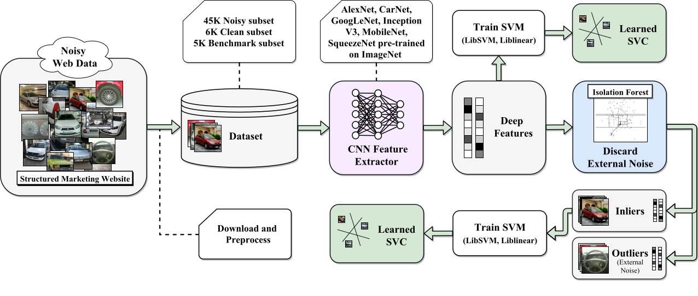
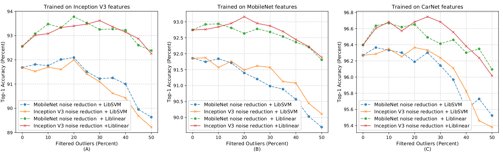

## [Transfer Learning Approach for Classification and Noise Reduction on Noisy Web Data  (ESWA 2018)](https://www.sciencedirect.com/science/article/pii/S0957417418301878?via%3Dihub)

## Abstract

One of the main ingredients to learn a visual representation of an object using the Convolutional Neural Networks is a large and carefully annotated dataset. Acquiring a dataset in a demanded scale is not a straightforward task; therefore, the community attempts to solve this problem by creating noisy datasets gathered from web sources. In this paper, this issue is tackled by designing a vehicle recognition system using Convolutional Neural Networks and noisy web data. In the proposed system, the transfer learning technique is employed, and behavior of several deep architectures trained on a noisy dataset are studied. In addition, the external noise of the gathered dataset is reduced by exploiting an unsupervised method called Isolation Forest, and the new training results are examined. Based on the experiments, high recognition accuracies were achieved by training two states of the art networkList on the noisy dataset, and the obtained results were slightly improved by using the proposed noise reduction framework. Finally, a demonstration application is provided to show the capability and the performance of the proposed approach.

## Proposed Approach

<p align="center"></p>
 
## Highlights

* Gathering an unsupervised image dataset of vehicle models from a marketing site.

* Studying the behavior and the performance of six well-known deep architectures in the vehicle recognition case using the transfer learning method on the gathered noisy dataset.

* Exploiting the Isolation Forest algorithm with CNN features to discard the external noise of the dataset and analyzing the noise reduction results.

* Demonstrating that a high recognition accuracy is attainable with the transfer learning method and it can be elevated using the proposed noise reduction framework.

* Providing an android application in which the proposed approach is implemented.

## Dataset

* Noisy subset: includes 45,000 images randomly sub-sampled from the main dataset (5,000 images per class).


* Clean subset: Contains 6,300 carefully annotated images (700 images per class). The annotation task is performed on 46,820 images, and there are no overlaps between the clean subset and the noisy one.

* Benchmark subset: Includes 4,950 images of clean images and labeled noisy ones (450 clean images per class and 900 noisy images in total)

You can download the dataset [here](https://mega.nz/#F!1HxDCDxb!cgLisUq7nuf4t_7QhUHs-g)

## Results
<p align="center"></p>
The flow of recognition accuracy while applying the noise reduction process, (left) Inception V3, (center) MobileNet, (right) CarNet.</br>
For further results, please read our paper or visit our webpage: https://www.sinabaharlou.com/VehicleRecognition

## Codes
This project provides an android application which demonstrates the methods discussed in the paper. It has the capability of recognizing the models of a group of specified vehicles. The application has been tested on the Lollipop version of Android. You can also find a demonstration notebook in the "notebook-demo" folder.

For a live demonstration with Tensorflow.js please visit the our webpage: https://www.sinabaharlou.com/VehicleRecognition

> **Requirements:**

> - Android Studio </br>
> - Gradle</br>
> - Tensorflow
> - OpenCV 2.4 

### How to Run 

Import the project in Android Studio, install the dependencies and run the project.


## Publication 
[](https://www.journals.elsevier.com/expert-systems-with-applications)
This article is published in the International Journal of Expert Systems with Applications (ESWA).</br>
Volume 105, 1 September 2018, Pages 221-232</br>
DOI: 10.1016/j.eswa.2018.03.042

If you use the provided dataset or find this article useful, please cite our paper:
```
@article{ABBASIAGHAMALEKI2018221,
title = "Transfer learning approach for classification and noise reduction on noisy web data",
journal = "Expert Systems with Applications",
volume = "105",
pages = "221 - 232",
year = "2018",
issn = "0957-4174",
doi = "https://doi.org/10.1016/j.eswa.2018.03.042",
url = "http://www.sciencedirect.com/science/article/pii/S0957417418301878",
author = "Javad Abbasi Aghamaleki and Sina Moayed Baharlou",
keywords = "Convolutional Neural Networks, Transfer learning, Vehicle recognition, Noisy dataset, Isolation forest"
}
```
